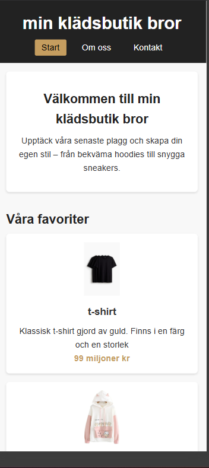

min klädsbutik bror

Detta är en enkel responsiv webbplats byggd i html och css, utan JavaScript.  
Syftet är att visa förståelse för semantisk struktur, tillgänglighet, och modern CSS-layout med Flexbox/Grid.

Demo
Länk till sidan:  
[min klädsbutik bror på GitHub Pages](https://samoeilsamoeil11-gif.github.io/min-kladsbutik-bror/)

Skärmdumpar
[Desktopversion](images/desktop.png.png)

Designbeslut

Färger
Jag har använt en enkel färgpalett med svart, beige och vit bakgrund.  
Det gör sidan lugn, tydlig och lättläst. Accentfärgen (guld/beige) används för att framhäva priser och viktiga knappar.

Typografi
Typsnittet är sans-serif (Poppins / Segoe UI) som är modernt och lätt att läsa på alla skärmar.  
Jag har även använt **clamp()** för att få flytande textstorlek som anpassar sig till skärmstorleken.

Layout
Layouten bygger på **CSS Grid** för produktgalleriet och **Flexbox** i navigeringen.  
Jag använde mobil-först-strategi med två brytpunkter (600px och 1024px) för att sidan ska fungera på alla enheter.

 UX & Tillgänglighet

- Skip-link: användare med tangentbord kan hoppa direkt till innehållet.  
- Fokusmarkeringar: tydlig gul kant vid tabb-navigering.  
- Alt-texter: alla bilder har beskrivande alt-texter.  
- Kontraster: färgerna uppfyller WCAG AA.  
- prefers-reduced-motion: tar bort animationer om användaren valt att minska rörelse.  

Jag har testat sidan med:
- Mobilvy i Chrome DevTools  
- Skärmläsarsimulering (kontrollerat rubrikordning och landmärken)  
- Tangentbordsnavigering med “Tab”-tangenten  

CSS-interaktivitet (utan JavaScript)

Jag har använt två CSS-baserade lösningar:

1. FAQ-sektion med 
 och 

öppnas och stängs utan JavaScript.

2. Hover-effekter på korten (produkter)
korten får skugga och lyfts upp när man hovrar över dem.

Båda fungerar med tangentbord och skärmläsare.

Struktur:
min-kladsbutik-bror/
│
├── index.html
├── om.html
├── kontakt.html
├── css/
│   └── style.css
└── images/
    ├── desktop.png
    ├── mobile.png
    ├── produktbilder
